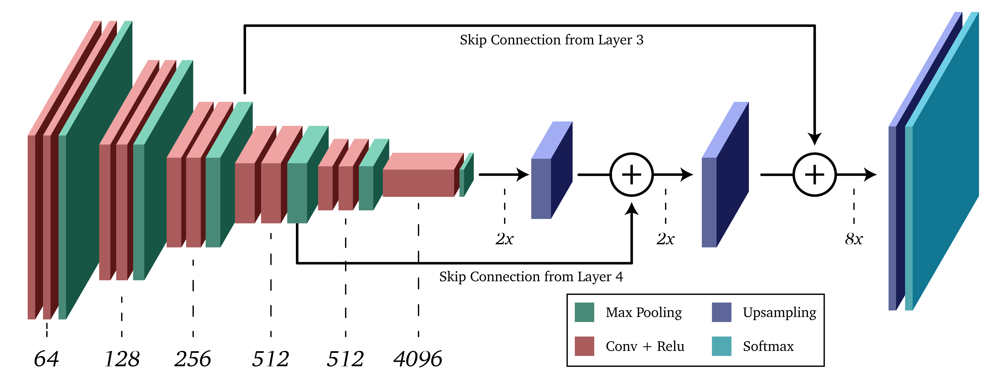

# semantic segmentation of images with Fully Convolutional Networks

Semantic segmentation is pixel-level classification of an image into different classes of object. Basically it is a method of image segmentation in which objects belonging to the same class are labelled same. Semantic segmentation helps in providing pixel-level precision for tasks such as human action recognition. Fully Convolutional Networks (FCN) has been used to obtain segmentation masks for humans performing different actions. FCN can take input of any size as the network comprises of only Convolutional Layers and no Fully Connected Layer. The input images are taken after performing object detection over scenic images to detect human. The images are categorized into five classes - Kick, Punch, Push, Handshake and Victim. The dataset is taken from UT-Interaction dataset available at below mentioned link.

http://cvrc.ece.utexas.edu/SDHA2010/Human_Interaction.html

The FCN-8 arcitecture uses standard VGG-16 network for downsampling and does upsampling through transpose convolution. In order to aid the reconstruction, skip connection from Layer 3 and Layer 4 are added to the upsampling layers.

GluonCV has been used to implement the FCN-8 model.

